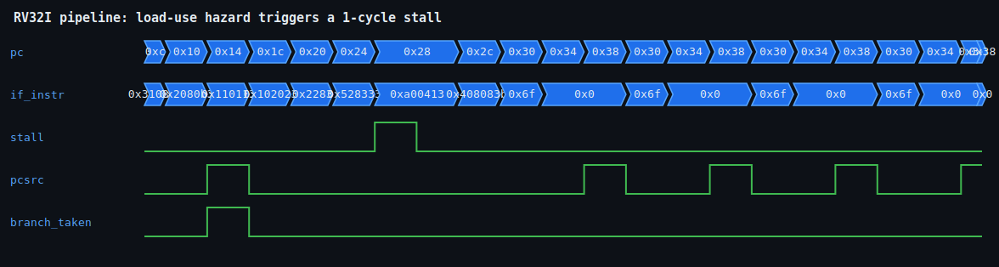

<h1 align="center">RV32I 5-STAGE PIPELINED PROCESSOR</h1>

<p align="center"><b>A synthesizable 32-bit RV32I 5-stage pipelined CPU in Verilog — full EX-stage forwarding, load-use hazard detection, branch resolution, and a bundled assembler.</b></p>

<p align="center">
  
  
  
  
</p>

<p align="center">Author: <b>Avinash Kollu</b> · GitHub: <a href="https://github.com/avinashkollu-git">@avinashkollu-git</a></p>

---

## Overview

`riscv-5stage-core` is an in-order, single-issue **RV32I** processor implementing the
classic five-stage pipeline: **IF → ID → EX → MEM → WB**. It is written in clean,
synthesizable Verilog and is fully self-verifying: a bundled Python assembler turns a
human-readable RV32I program into a hex image, an Icarus Verilog testbench runs it, and a
self-checking harness peeks into the register file and data memory to compare against golden
values.

The design implements the three hazard mechanisms that make a real pipeline correct:
data forwarding, load-use interlock, and control-hazard flushing. Every path is exercised by
a test program that computes `sum(1..10) = 55` through a branch loop, stores and reloads the
result through memory, and chains dependent arithmetic to stress the forwarding network.

---

## Highlights

- **True 5-stage pipeline** — IF, ID, EX, MEM, WB with explicit pipeline registers between
  every stage (`IF/ID`, `ID/EX`, `EX/MEM`, `MEM/WB`).
- **Full EX-stage data forwarding** — both operands can be bypassed from `EX/MEM` and
  `MEM/WB`, eliminating stalls for back-to-back dependent ALU instructions.
- **Load-use hazard detection** — a dedicated hazard unit detects the load-use case in ID and
  inserts exactly **one** bubble, holding the PC and `IF/ID` register.
- **Branch and jump resolution in EX** — a taken redirect flushes `IF/ID` and `ID/EX`
  (a 2-cycle penalty) and steers the PC to the target.
- **Write-first register file** — writes on `negedge` so a WB result is visible to an ID read
  in the *same* cycle, closing the tightest RAW dependency.
- **Bundled RV32I assembler** — a real Python tool (`tools/assemble.py`) that turns
  `program.asm` into `$readmemh`-loadable hex. Write your own program and re-run.
- **Self-checking testbench** — golden-value checks over the register file and data memory;
  the shipped program passes end to end (`RESULT: ALL TESTS PASSED`).
- **Open-source flow** — Icarus Verilog for simulation, GTKWave for waveforms, a committed
  reference waveform in `docs/`.

---

## Pipeline Diagram

```text
        IF               ID               EX              MEM              WB
   +----------+     +----------+     +----------+    +----------+    +----------+
   |  PC /    |     |  Decode  |     |   ALU    |    |  Data    |    | Write-   |
   |  IMem    | --> | Regfile  | --> | Branch   | -->|  Memory  | -->| back to  |
   |          |     |  read    |     | compare  |    | (LW/SW)  |    | Regfile  |
   +----------+     +----------+     +----------+    +----------+    +----------+
        |     [IF/ID]     |    [ID/EX]    |   [EX/MEM]     |  [MEM/WB]   |
        |                 |               |               |             |
        |                 |               |<--------------+ EX/MEM -> EX (forward)
        |                 |               |<----------------------------+ MEM/WB -> EX (forward)
        |                 |               |
        |                 |  load-use stall (detected in ID): hold PC + IF/ID, bubble ID/EX
        |                 |
        +<----------------+--------------- pcsrc redirect (branch/jump taken in EX)
                          flush IF/ID and ID/EX on taken redirect (2-cycle penalty)
```

- **Forwarding paths:** `EX/MEM → EX` and `MEM/WB → EX` feed the ALU operand muxes so
  dependent instructions never wait when the producer is an ALU op.
- **Load-use stall:** detected in ID when the instruction in EX is a load whose `rd` is a
  source register of the instruction in ID — the PC and `IF/ID` are frozen for one cycle and
  an `ID/EX` bubble is injected.
- **Control redirect:** branch/jump outcome is computed in EX; on a taken redirect `pcsrc`
  steers the PC to the target and `IF/ID` + `ID/EX` are flushed.

---

## Supported Instructions

Full RV32I integer subset. Loads and stores are word-granular.

| Type          | Instructions |
|---------------|--------------|
| R-type        | `add` `sub` `and` `or` `xor` `sll` `srl` `sra` `slt` `sltu` |
| I-type (ALU)  | `addi` `andi` `ori` `xori` `slli` `srli` `srai` `slti` `sltiu` |
| Load          | `lw` |
| Store         | `sw` |
| Branch        | `beq` `bne` `blt` `bge` `bltu` `bgeu` |
| Jump          | `jal` `jalr` |
| Upper-immediate | `lui` `auipc` |

---

## Microarchitecture

### Forwarding

The forwarding unit compares the source registers of the instruction in EX against the
destination registers held in `EX/MEM` and `MEM/WB`. When a match is found (and the producer
actually writes a non-`x0` register), the corresponding ALU operand is bypassed directly from
the later pipeline register instead of the stale value read from the register file. Both the
`rs1` and `rs2` operands are handled independently, and `EX/MEM` takes priority over `MEM/WB`
so the most recent producer wins. This lets a chain of dependent ALU instructions run at full
throughput with no bubbles.

### Load-Use Hazard

Forwarding cannot rescue a load-use dependency: a load's result is not available until the end
of MEM, one stage too late to bypass into the dependent instruction's EX. The hazard unit
detects this in ID — the instruction in EX is a load and its destination register is a source
of the instruction currently in ID — and inserts a single stall cycle. During the stall the PC
and the `IF/ID` register hold their values while `ID/EX` is cleared to a bubble, so the load
advances to MEM and its value is then forwarded normally into the following EX.

### Control Hazards / Branch Resolution

Branches and jumps are resolved in EX by a dedicated branch comparator (for the six branch
conditions) and target adder (for `beq/…/bgeu`, `jal`, and `jalr`). Until the outcome is known,
two instructions have already entered the pipeline behind the branch. On a taken redirect the
core asserts `pcsrc`, steers the PC to the computed target, and flushes both `IF/ID` and
`ID/EX`, giving a fixed 2-cycle penalty per taken control transfer. Not-taken branches proceed
with no penalty.

### Register File Write-First

The 32×32 register file hardwires `x0` to zero and performs its write on the **negedge** of the
clock, while reads are combinational. Because writeback lands on the falling edge and the ID
read samples on the rising edge, a value written by WB is visible to a dependent ID read in the
*same* cycle. This "write-first" behavior closes the shortest RAW window without any extra
forwarding path into ID.

---

## Repository Layout

```text
riscv-5stage-core/
├── rtl/
│   ├── riscv_defs.vh      opcode + ALU function-code definitions (shared header)
│   ├── alu.v              32-bit ALU (arithmetic, logic, shifts, comparisons)
│   ├── regfile.v          32x32 register file, x0 = 0, write-first on negedge
│   ├── imm_gen.v          immediate decoder (I / S / B / U / J formats)
│   ├── control_unit.v     main decoder: opcode -> control signals
│   └── riscv_core.v       pipelined datapath: pipeline regs, forwarding, hazard/stall, branch cmp
├── tb/
│   ├── program.asm        demo program (sum 1..10, store/reload, dependent arithmetic)
│   ├── tb_riscv_core.v    self-checking testbench (golden regfile + memory checks)
│   ├── program_isa.asm    ISA-coverage program (exercises every supported instruction)
│   └── tb_riscv_isa.v     self-checking ISA testbench (24 golden checks)
├── tools/
│   ├── assemble.py        tiny RV32I assembler: *.asm -> *.hex ($readmemh)
│   └── vcd2svg.py         renders a simulation VCD into an SVG waveform
├── docs/
│   └── riscv_wave.svg     committed reference waveform
├── program.hex            assembled demo program (hex image)
├── program_isa.hex        assembled ISA-coverage program
├── Makefile               build / test / waveform targets
└── LICENSE                MIT
```

---

## The Bundled Assembler

`tools/assemble.py` is a small, real RV32I assembler: it parses `tb/program.asm`, resolves
labels, encodes each instruction, and emits `program.hex` in the `$readmemh` format the core
loads at reset. You can edit `program.asm`, run `make asm`, and re-simulate your own program.

A slice of the shipped test program — the accumulation loop that computes `sum(1..10)`:

```asm
    li   x1, 0            # x1 = running sum
    li   x2, 1            # x2 = loop counter i
    li   x3, 11           # loop limit
loop:
    beq  x2, x3, done     # exit when i == 11   (resolved in EX)
    add  x1, x1, x2       # sum += i            (x1 forwarded each iteration)
    addi x2, x2, 1        # i++
    j    loop
done:
```

---

## Build & Run

```sh
make test       # run BOTH testbenches: the pipeline demo and full ISA coverage
make test-core  # just the sum/forwarding/load-use demo program
make test-isa   # just the ISA-coverage test (every supported instruction)
make wave       # regenerate docs/riscv_wave.svg from the simulation VCD
```

`make test` proves the whole design: it assembles the programs, elaborates the RTL with
Icarus Verilog, and runs two self-checking testbenches — the pipeline demo (below) and an
**ISA-coverage test** that exercises every supported instruction (all R/I-type ALU ops,
`lw`/`sw`, all six branch types taken and not-taken, `jal`/`jalr`, `lui`, `auipc`) and
checks 24 golden values. Drop your own RV32I code into `tb/program.asm` and re-run to test it.

---

## Results

Verified with Icarus Verilog. The testbench checks each value against a golden reference:

| Location | Value | What it proves |
|----------|-------|----------------|
| `x1`     | `55`  | `sum(1..10)` — iterative accumulation with per-iteration forwarding of `x1` |
| `x5`     | `55`  | reloaded from `mem[0]` via `LW` |
| `x6`     | `110` | `x5 + x5` — load-use forwarding *after* the one-cycle stall |
| `x7`     | `45`  | `55 - 10` — `SUB` with forwarded operands |
| `x2`     | `11`  | final loop counter (loop exits after 10 iterations) |
| `mem[0]` | `55`  | store then reload path through data memory |

```text
RESULT: ALL TESTS PASSED
```

---

## Waveform



The waveform shows `stall` asserting for a single cycle while the PC holds during the load-use
hazard, and the `pcsrc` redirects firing during the loop as branches and jumps resolve in EX.

---

## Verification Strategy

Verification is done by a **self-checking testbench** (`tb/tb_riscv_core.v`) that peeks into the
register file and data memory after execution and compares every result against golden values,
printing `RESULT: ALL TESTS PASSED` only when all checks hold. The test program is deliberately
constructed to exercise all three hazard mechanisms: the accumulation loop forwards `x1` every
iteration and drives branch resolution in EX; the store-then-reload sequence forces a real
load-use stall; and the dependent arithmetic that follows confirms the load result is forwarded
correctly out of the stall. Because the assembler is part of the flow, adding a new directed
test is as simple as editing `program.asm` and re-running `make test`.

---

## Possible Extensions

- CSR registers and a basic interrupt/exception path (machine mode).
- Byte- and half-word loads/stores (`lb` `lh` `lbu` `lhu` `sb` `sh`).
- Dynamic branch prediction (BTB / 2-bit saturating counters) to cut the taken-branch penalty.
- FPGA synthesis and place-and-route through the open-source Yosys flow.

---

## Skills Demonstrated

- Computer architecture and pipeline design (IF/ID/EX/MEM/WB, hazard theory)
- Hazard and forwarding logic: bypass network, load-use interlock, control-flow flushing
- RV32I ISA implementation (decode, immediate generation, ALU, control)
- Datapath and control co-design in synthesizable Verilog
- Toolchain / assembler authoring (RV32I → hex) in Python
- Functional verification with a self-checking testbench and golden-value checks

---

## License

Released under the [MIT License](LICENSE).
